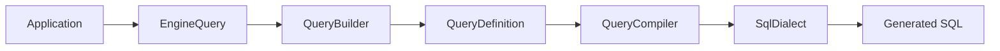
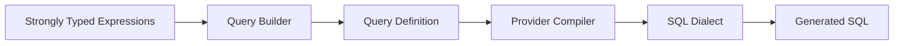
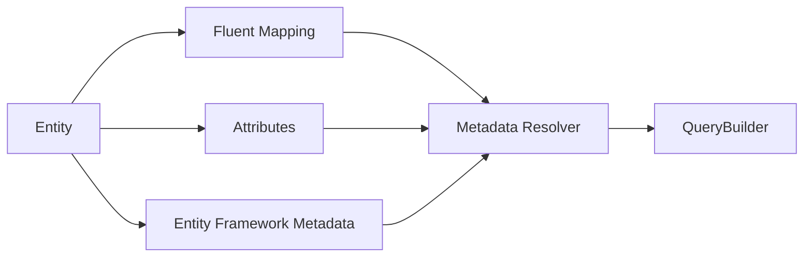
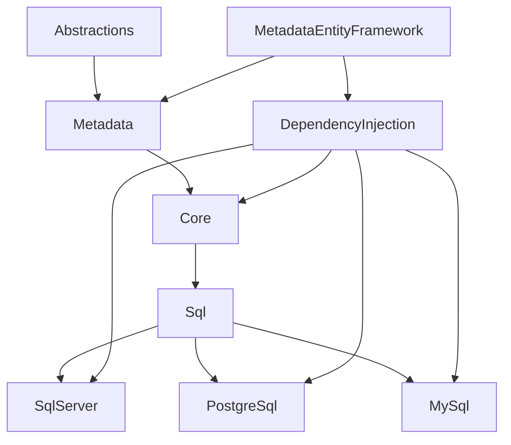

# TinyBlueWhale.EngineQuery

Strongly typed, provider-agnostic SQL query builder for .NET.

EngineQuery helps developers build deterministic, provider-specific SQL using compile-time safe expressions while remaining lightweight, explicit and fully compatible with existing data access technologies such as Dapper.

Generate SQL for SQL Server, PostgreSQL and MySQL without sacrificing readability, maintainability or control over the generated queries.

[](https://www.nuget.org/packages/TinyBlueWhale.EngineQuery.DependencyInjection)
[](https://www.nuget.org/packages/TinyBlueWhale.EngineQuery.DependencyInjection)
[](LICENSE)
[]()

> **EngineQuery 1.0** is the first stable release and is production-ready for deterministic SQL generation.

---

# Contents

- [The Problem](#the-problem)
- [Why EngineQuery Exists](#why-enginequery-exists)
- [Philosophy](#philosophy)
- [Design Principles](#design-principles)
- [When Should I Use EngineQuery?](#when-should-i-use-enginequery)
- [Choosing the Right Tool](#choosing-the-right-tool)
- [Features](#features)
- [Architecture](#architecture)
- [Packages](#packages)
- [Installation](#installation)
- [Quick Start](#quick-start)
- [Generated SQL](#generated-sql)
- [Advanced Query Features](#advanced-query-features)
- [FAQ](#faq)
- [Project Status](#project-status)
- [Support](#support)
- [License](#license)

---

# The Problem

Modern .NET applications usually evolve toward one of two approaches.

The first relies on an ORM such as Entity Framework Core.

While ORMs provide an excellent developer experience for CRUD operations, they become increasingly difficult to optimize when applications require complex reporting queries, provider-specific SQL capabilities or carefully tuned execution plans.

The second approach relies on handwritten SQL executed through libraries such as Dapper.

Although this provides complete control over the generated SQL, it often leads to duplicated SQL strings, difficult maintenance, reduced reuse and little compile-time validation.

As applications grow, developers frequently encounter scenarios such as:

- Complex reporting
- Dynamic filtering
- Multi-provider applications
- Recursive queries
- Window functions
- Advanced aggregations
- Provider-specific SQL
- Large SQL files maintained as string literals

EngineQuery was created to bridge that gap.

It provides a strongly typed SQL construction layer capable of generating deterministic SQL while allowing developers to retain complete control over the generated statements.

---

# Why EngineQuery Exists

EngineQuery was designed around one simple idea:

> Developers should control the SQL being generated.

Instead of translating LINQ into provider-dependent SQL or manually concatenating SQL strings, EngineQuery provides a fluent, strongly typed API that produces explicit and predictable SQL.

The objective is not to hide SQL.

The objective is to make SQL easier to compose, maintain and validate.

EngineQuery complements existing data access technologies instead of replacing them.

It integrates naturally with Dapper, CQRS read models, reporting systems and applications where SQL remains a first-class citizen.

---

# Philosophy

EngineQuery follows a small set of engineering principles that influence every design decision.

## Deterministic SQL

The same query definition always generates the same SQL for the same provider.

Deterministic SQL simplifies testing, benchmarking, code reviews and performance tuning.

---

## Compile-Time Safety

Whenever possible, queries should be validated by the compiler instead of failing at runtime.

Strongly typed expressions significantly reduce errors caused by string-based SQL construction.

---

## Explicit over Implicit

EngineQuery never attempts to infer developer intent.

Every projection, JOIN, aggregate and SQL construct is explicitly defined.

Explicit APIs produce predictable SQL.

---

## Provider-Aware Compilation

Each supported database engine has different SQL capabilities.

EngineQuery compiles SQL through provider-specific dialects instead of attempting to generate generic SQL.

---

## Lightweight Infrastructure

EngineQuery focuses exclusively on SQL generation.

Responsibilities intentionally outside its scope include:

- Database connections
- Query execution
- Change tracking
- Entity persistence
- Database migrations

---

## Composition over Magic

Complex SQL should be composed from smaller building blocks.

Instead of generating hidden SQL behind abstraction layers, EngineQuery encourages explicit composition using fluent builders.

---

# Design Principles

EngineQuery was built around a small set of engineering principles.

- Strongly typed APIs
- Deterministic SQL generation
- Provider-specific compilation
- Explicit configuration
- Lightweight infrastructure
- Composition over hidden behavior
- Predictable SQL output

---

# When Should I Use EngineQuery?

EngineQuery is particularly useful when applications require dynamic SQL while maintaining readability and compile-time safety.

Typical scenarios include:

- Reporting systems
- CQRS read models
- Business intelligence
- Dynamic search
- Analytics
- Multi-tenant applications
- Multi-provider architectures
- High-performance APIs
- SQL-heavy enterprise applications
- Dapper-based systems

For simple CRUD applications with minimal SQL customization, Entity Framework Core may provide a better developer experience.

---

# Choosing the Right Tool

Different tools solve different problems.

EngineQuery is designed to complement existing technologies rather than replace them.

| Scenario | Recommended Tool |
|-----------|------------------|
| CRUD applications | Entity Framework Core |
| Execute handwritten SQL | Dapper |
| Generate dynamic SQL | EngineQuery |
| Complex reporting | EngineQuery |
| Provider-specific SQL | EngineQuery |
| Change tracking | Entity Framework Core |
| SQL generation + execution | EngineQuery + Dapper |
| Database migrations | FluentMigrator |

---

## EngineQuery vs Dapper

Dapper executes SQL.

EngineQuery generates SQL.

The two libraries work exceptionally well together.

```text
EngineQuery
      │
      ▼
Generated SQL
      │
      ▼
Dapper
      │
      ▼
Database
```

---

## EngineQuery vs Entity Framework Core

Entity Framework Core focuses on entity persistence and change tracking.

EngineQuery focuses exclusively on deterministic SQL generation.

Use Entity Framework Core when working primarily with CRUD operations.

Use EngineQuery when building:

- Reporting queries
- Provider-specific SQL
- Dynamic SQL
- Highly optimized read models

Both technologies can coexist within the same application.

EngineQuery can also reuse Entity Framework Core metadata.

---

## EngineQuery vs SqlKata

Both libraries provide fluent SQL construction.

The primary difference lies in the design philosophy.

SqlKata primarily builds SQL using string identifiers.

EngineQuery emphasizes compile-time safety through strongly typed expressions and metadata-aware query generation.

---

## EngineQuery vs Handwritten SQL

Writing SQL manually provides maximum flexibility.

However, as applications grow, manually maintained SQL often becomes difficult to reuse, validate and evolve.

EngineQuery preserves SQL readability while reducing duplication and providing compile-time validation where possible.

---

# Features

EngineQuery provides deterministic SQL generation through a modular architecture.

## Query Construction

- Strongly typed query builder
- Compile-time safe expressions
- Deterministic SQL generation
- Dynamic query composition
- Derived tables
- Nested subqueries
- Common Table Expressions
- Recursive Common Table Expressions

## SQL Features

- SELECT
- DISTINCT
- INNER JOIN
- LEFT JOIN
- EXISTS / NOT EXISTS
- APPLY / LATERAL
- GROUP BY
- HAVING
- CASE WHEN
- Aggregate functions
- Scalar SQL functions
- Window functions
- Pagination
- UNION
- UNION ALL
- INTERSECT
- EXCEPT

## Metadata

- Fluent Mapping
- Attribute Mapping
- Entity Framework Core Metadata
- Alias-aware SQL generation

## Infrastructure

- Multi-provider architecture
- Provider-specific SQL dialects
- Dependency Injection
- Snapshot testing
- Benchmark project

# Architecture

EngineQuery separates query composition from SQL compilation.

Applications build strongly typed query definitions while provider-specific compilers generate deterministic SQL for each supported database engine.



This separation allows EngineQuery to support multiple SQL dialects while keeping the public API identical across providers.

---

## SQL Compilation Pipeline

Every query follows the same compilation pipeline regardless of the selected provider.



Each provider is responsible only for translating SQL according to its own dialect.

The fluent API remains provider agnostic.

---

## Metadata Resolution

Metadata can be obtained from multiple sources.



This allows existing applications to reuse mapping definitions without maintaining duplicate metadata.

---

## Package Architecture

EngineQuery is intentionally modular.

Applications only reference the packages they actually need.



---

# Packages

| Package | Purpose |
|----------|---------|
| TinyBlueWhale.EngineQuery.DependencyInjection | Recommended entry point |
| TinyBlueWhale.EngineQuery.Core | Strongly typed query builder |
| TinyBlueWhale.EngineQuery.Sql | SQL compilation infrastructure |
| TinyBlueWhale.EngineQuery.SqlServer | SQL Server dialect |
| TinyBlueWhale.EngineQuery.PostgreSql | PostgreSQL dialect |
| TinyBlueWhale.EngineQuery.MySql | MySQL dialect |
| TinyBlueWhale.EngineQuery.Metadata | Metadata abstractions |
| TinyBlueWhale.EngineQuery.Metadata.EntityFramework | Entity Framework Core metadata integration |
| TinyBlueWhale.EngineQuery.Abstractions | Shared contracts |

---

## Which package should I install?

| Scenario | Package |
|----------|---------|
| Most applications | TinyBlueWhale.EngineQuery.DependencyInjection |
| Manual composition | TinyBlueWhale.EngineQuery.Core |
| SQL Server only | TinyBlueWhale.EngineQuery.SqlServer |
| PostgreSQL only | TinyBlueWhale.EngineQuery.PostgreSql |
| MySQL only | TinyBlueWhale.EngineQuery.MySql |
| Reuse Entity Framework metadata | TinyBlueWhale.EngineQuery.Metadata.EntityFramework |
| Build custom providers | TinyBlueWhale.EngineQuery.Sql + TinyBlueWhale.EngineQuery.Abstractions |

---

# Installation

For most applications, install the Dependency Injection package.

```bash
dotnet add package TinyBlueWhale.EngineQuery.DependencyInjection
```

EngineQuery targets:

- .NET 8
- .NET 9

---

# Quick Start

Register EngineQuery using Dependency Injection.

```csharp
services.AddEngineQuery(options =>
{
    options.Add(QueryEngineProvider.SqlServer, metadata =>
    {
        metadata.UseFluentMetadata(BuildMetadata.Create);
    });
});
```

Inject an `IQueryEngine`.

```csharp
public sealed class UserReportService
{
    private readonly IQueryEngine _queryEngine;

    public UserReportService(IQueryEngine queryEngine)
    {
        _queryEngine = queryEngine;
    }

    public GeneratedSqlQuery Build()
    {
        return _queryEngine
            .From<User>(alias: "u")
            .Select<User>(u => new
            {
                u.Id,
                u.Email
            })
            .Where<User>(u => u.IsActive)
            .OrderBy<User>(u => u.Id)
            .Build();
    }
}
```

---

# Generated SQL

The previous query produces deterministic SQL.

```sql
SELECT
    [u].[Id],
    [u].[Email]
FROM [Users] AS [u]
WHERE [u].[IsActive] = 1
ORDER BY [u].[Id] ASC
```

The generated SQL remains explicit, readable and suitable for:

- Debugging
- Performance tuning
- Snapshot testing
- Benchmarking
- Code reviews

---

## Multiple Providers

Multiple providers can coexist within the same application.

```csharp
services.AddEngineQuery(options =>
{
    options.Add(QueryEngineProvider.SqlServer, metadata =>
    {
        metadata.UseFluentMetadata(SqlServerMetadata.Create);
    });

    options.Add(QueryEngineProvider.PostgreSql, metadata =>
    {
        metadata.UseAttributeMetadata();
    });

    options.Add(QueryEngineProvider.MySql, metadata =>
    {
        metadata.UseEntityFrameworkMetadata<ApplicationDbContext>();
    });
});
```

Providers can be resolved dynamically.

```csharp
public sealed class ReportService
{
    private readonly IQueryEngineFactory _factory;

    public ReportService(IQueryEngineFactory factory)
    {
        _factory = factory;
    }

    public GeneratedSqlQuery Build()
    {
        return _factory
            .Create(QueryEngineProvider.SqlServer)
            .From<User>()
            .Build();
    }
}
```

# Advanced Query Features

Every code sample shown below is extracted from the Playground validators and automated tests included in this repository.

This guarantees that every example compiles, is validated and reflects the current public API of EngineQuery.

EngineQuery provides first-class support for advanced SQL constructs commonly required in reporting systems, analytics, CQRS read models and enterprise applications.

---

# Working with Projections

## Computed Expressions

EngineQuery supports computed SQL expressions using strongly typed lambda expressions.

```csharp
var query = queryBuilder
    .From<JoinOrder>(alias: "o")
    .Select<JoinOrder>(o => new
    {
        OrderId = o.Id,
        o.Total
    })
    .SelectComputed<JoinOrder>(
        o => o.Total * 1.16m,
        alias: "TotalWithTax")
    .SelectComputed<JoinOrder>(
        o => (o.Total * 1.16m) - 100,
        alias: "FinalAmount")
    .Build();
```

Typical scenarios include:

- Financial calculations
- Taxes
- Discounts
- Derived business values

---

## Scalar SQL Functions

Provider-specific scalar SQL functions can be projected using strongly typed expressions.

```csharp
var query = queryBuilder
    .From<JoinUser>(alias: "u")
    .Select<JoinUser>(u => new
    {
        UserId = u.Id
    })
    .SelectScalarFunction<JoinUser>(
        QueryScalarFunction.Upper,
        u => u.Email,
        alias: "NormalizedEmail")
    .SelectScalarFunction<JoinUser>(
        QueryScalarFunction.Length,
        u => u.Email,
        alias: "EmailLength")
    .SelectScalarFunction<JoinUser>(
        QueryScalarFunction.Trim,
        u => u.Email,
        alias: "TrimmedEmail")
    .Build();
```

---

## CASE WHEN

Conditional SQL projections can be expressed using compile-time safe predicates.

```csharp
var query = queryBuilder
    .From<JoinOrder>(alias: "o")
    .Select<JoinOrder>(o => new
    {
        OrderId = o.Id,
        o.Total
    })
    .SelectCaseWhen<JoinOrder>(
        o => o.Total > 1000 && o.Total < 5000,
        whenTrue: "VIP",
        whenFalse: "STANDARD",
        alias: "CustomerType")
    .SelectCaseWhen<JoinOrder>(
        o => o.Total <= 0,
        whenTrue: "INVALID",
        whenFalse: "VALID",
        alias: "OrderStatus")
    .Build();
```

Typical scenarios include:

- Status mapping
- Customer classification
- Reporting
- Business rules

---

# Aggregation

## Aggregate Functions

Aggregate projections remain strongly typed.

```csharp
var query = queryBuilder
    .From<JoinUser>(alias: "u")
    .InnerJoin<JoinUser, JoinOrder>(
        alias: "o",
        on: (u, o) => u.Id == o.UserId)
    .Select<JoinUser>(u => new
    {
        UserId = u.Id,
        u.Email
    })
    .SelectAggregate<JoinOrder>(
        QueryAggregateFunction.Sum,
        o => o.Total,
        alias: "TotalAmount")
    .SelectAggregate<JoinOrder>(
        QueryAggregateFunction.Count,
        o => o.Id,
        alias: "OrderCount")
    .GroupBy<JoinUser>(u => new
    {
        u.Id,
        u.Email
    })
    .Build();
```

Supported aggregate functions include:

- COUNT
- SUM
- AVG
- MIN
- MAX

---

## HAVING

Filtering grouped results is supported through aggregate predicates.

```csharp
var query = queryBuilder
    .From<JoinUser>(alias: "u")
    .InnerJoin<JoinUser, JoinOrder>(
        alias: "o",
        on: (u, o) => u.Id == o.UserId)
    .Select<JoinUser>(u => new
    {
        UserId = u.Id,
        u.Email
    })
    .SelectAggregate<JoinOrder>(
        QueryAggregateFunction.Sum,
        o => o.Total,
        alias: "TotalAmount")
    .GroupBy<JoinUser>(u => new
    {
        u.Id,
        u.Email
    })
    .HavingAggregate<JoinOrder>(
        QueryAggregateFunction.Sum,
        o => o.Total,
        QueryComparisonOperator.GreaterThan,
        1000)
    .Build();
```

---

# Predicates

## Computed Predicates

Computed expressions are also supported inside WHERE clauses.

```csharp
var query = queryBuilder
    .From<JoinOrder>(alias: "o")
    .Select<JoinOrder>(o => new
    {
        OrderId = o.Id,
        o.Total
    })
    .WhereComputed<JoinOrder>(
        o => (o.Total * 1.16m) > 1000)
    .WhereComputed<JoinOrder>(
        o => (o.Total - 50) <= 500)
    .Build();
```

---

## Scalar Function Predicates

Scalar SQL functions can also be used as filtering expressions.

```csharp
var query = queryBuilder
    .From<JoinUser>(alias: "u")
    .Select<JoinUser>(u => new
    {
        UserId = u.Id,
        u.Email
    })
    .WhereScalarFunction<JoinUser>(
        QueryScalarFunction.Lower,
        u => u.Email,
        QueryComparisonOperator.Equal,
        "admin@test.com")
    .WhereScalarFunction<JoinUser>(
        QueryScalarFunction.Length,
        u => u.Email,
        QueryComparisonOperator.GreaterThan,
        10)
    .Build();
```

---

# Subqueries

## EXISTS

```csharp
var query = queryBuilder
    .From<JoinUser>(alias: "u")
    .Select<JoinUser>(u => new
    {
        UserId = u.Id,
        u.Email
    })
    .WhereExists<JoinOrder>(
        builder => builder
            .From<JoinOrder>(alias: "o")
            .Where<JoinOrder>(o => o.Total > 100))
    .Build();
```

---

## Correlated EXISTS

```csharp
var query = queryBuilder
    .From<JoinUser>(alias: "u")
    .Select<JoinUser>(u => new
    {
        UserId = u.Id,
        u.Email
    })
    .WhereExists<JoinUser, JoinOrder>(
        alias: "o",
        builder => builder
            .WhereComputed<JoinOrder, JoinUser>(
                (o, u) => o.UserId == u.Id && o.Total > 100))
    .Build();
```

---

## NOT EXISTS

```csharp
var query = queryBuilder
    .From<JoinUser>(alias: "u")
    .Select<JoinUser>(u => new
    {
        UserId = u.Id,
        u.Email
    })
    .WhereNotExists<JoinUser, JoinOrder>(
        alias: "o",
        builder => builder
            .WhereComputed<JoinOrder, JoinUser>(
                (o, u) => o.UserId == u.Id && o.Total > 100))
    .Build();
```

---

## IN Subquery

```csharp
var query = queryBuilder
    .From<JoinUser>(alias: "u")
    .Select<JoinUser>(u => new
    {
        UserId = u.Id,
        u.Email
    })
    .WhereIn<JoinUser, JoinOrder>(
        u => u.Id,
        alias: "o",
        builder => builder
            .Select<JoinOrder>(o => new
            {
                o.UserId
            })
            .Where<JoinOrder>(o => o.Total > 100))
    .Build();
```

---

# Common Table Expressions

## Derived Tables

EngineQuery supports derived tables while preserving strong typing.

```csharp
// See DerivedTableValidator in the Playground project.
```

---

## Common Table Expressions

Reusable query expressions can be defined using CTEs.

```csharp
// See CommonTableExpressionValidator in the Playground project.
```

---

## Recursive Common Table Expressions

Recursive queries are supported through dedicated builders.

```csharp
// See RecursiveCommonTableExpressionValidator in the Playground project.
```

---

# Window Functions

EngineQuery supports ANSI SQL window functions.

Available functions include:

- ROW_NUMBER
- RANK
- DENSE_RANK
- FIRST_VALUE
- LAST_VALUE
- NTILE

```csharp
// See WindowFunction validators in the Playground project.
```

---

# APPLY / LATERAL

Provider-specific APPLY / LATERAL generation is supported transparently.

```csharp
// See CrossApplyValidator and OuterApplyValidator.
```

SQL Server generates:

- CROSS APPLY
- OUTER APPLY

PostgreSQL and MySQL generate the equivalent LATERAL syntax when supported by the provider.

---

# Set Operations

EngineQuery supports ANSI SQL set operators.

- UNION
- UNION ALL
- INTERSECT
- EXCEPT

```csharp
// See SetOperation validators in the Playground project.
```

---

# Playground

The repository includes a Playground project containing executable examples for every major EngineQuery capability.

The Playground serves as executable documentation and demonstrates:

- SQL Server generation
- PostgreSQL generation
- MySQL generation
- Metadata strategies
- Advanced SQL features

---

# Benchmarks

EngineQuery includes a BenchmarkDotNet project focused on SQL generation performance.

Current benchmark scenarios include:

- Basic projections
- Aggregations
- EXISTS
- Derived tables
- Window functions
- Provider compilation

Benchmarks measure SQL generation performance rather than database execution.

---

# Testing Strategy

EngineQuery validates generated SQL using automated tests and provider-specific snapshot verification.

Every public feature documented in this README is backed by automated tests or Playground validators to ensure deterministic SQL generation across supported providers.

# FAQ

## Is EngineQuery an ORM?

No.

EngineQuery focuses exclusively on deterministic SQL generation.

It does not provide:

- Change tracking
- Entity persistence
- Lazy loading
- Object graph management
- Database migrations

---

## Can EngineQuery replace Dapper?

No.

Dapper and EngineQuery solve different problems.

EngineQuery generates SQL.

Dapper executes SQL.

They are designed to work together.

```text
EngineQuery
      │
      ▼
Generated SQL
      │
      ▼
Dapper
      │
      ▼
Database
```

---

## Can EngineQuery replace Entity Framework Core?

No.

Entity Framework Core is an Object-Relational Mapper focused on persistence.

EngineQuery is a SQL generation library.

Both technologies can coexist within the same application.

EngineQuery can even reuse Entity Framework Core metadata through the `TinyBlueWhale.EngineQuery.Metadata.EntityFramework` package.

---

## Does EngineQuery execute SQL?

No.

EngineQuery only generates SQL and the corresponding parameters.

Execution is delegated to your preferred data access technology.

Examples include:

- Dapper
- ADO.NET
- Microsoft.Data.SqlClient
- Npgsql
- MySqlConnector

---

## Which database providers are supported?

EngineQuery currently supports:

- SQL Server
- PostgreSQL
- MySQL

Each provider uses its own SQL dialect compiler while sharing the same fluent API.

---

## Can I implement my own SQL provider?

Yes.

EngineQuery was designed around a provider-agnostic architecture.

Custom providers can be implemented using:

- TinyBlueWhale.EngineQuery.Abstractions
- TinyBlueWhale.EngineQuery.Sql

---

## Can I reuse Entity Framework Core mappings?

Yes.

The `TinyBlueWhale.EngineQuery.Metadata.EntityFramework` package allows EngineQuery to reuse EF Core metadata without maintaining duplicate mapping definitions.

---

## Is EngineQuery suitable for production?

Yes.

EngineQuery 1.0 is intended for production use in applications requiring deterministic SQL generation.

---

# Project Status

EngineQuery 1.0 is the first stable release.

## Supported Frameworks

| Framework | Supported |
|-----------|:---------:|
| .NET 8 | ✅ |
| .NET 9 | ✅ |

---

## Supported Providers

| Provider | Supported |
|----------|:---------:|
| SQL Server | ✅ |
| PostgreSQL | ✅ |
| MySQL | ✅ |

---

## Supported Features

| Category | Status |
|----------|:------:|
| Strongly Typed Query Builder | ✅ |
| Provider-specific SQL Compilation | ✅ |
| Fluent Metadata | ✅ |
| Attribute Metadata | ✅ |
| Entity Framework Metadata | ✅ |
| Dependency Injection | ✅ |
| Computed Expressions | ✅ |
| Aggregate Functions | ✅ |
| CASE WHEN | ✅ |
| Scalar Functions | ✅ |
| Window Functions | ✅ |
| Common Table Expressions | ✅ |
| Recursive CTE | ✅ |
| EXISTS / NOT EXISTS | ✅ |
| APPLY / LATERAL | ✅ |
| Set Operations | ✅ |
| Snapshot Testing | ✅ |
| Benchmarks | ✅ |

---

# Documentation

The repository includes multiple resources for learning and validating EngineQuery.

| Resource | Description |
|----------|-------------|
| README | Project overview and getting started |
| Playground | Executable examples |
| Tests | API validation |
| Provider Validators | SQL comparison across providers |
| Benchmarks | Performance evaluation |
| CHANGELOG | Release history |

---

# Support

If you encounter a bug, have a feature request or need clarification about the API, please open an issue in the GitHub repository.

Community feedback is always welcome and helps improve EngineQuery.

---

# License

EngineQuery is released under the MIT License.

See the [LICENSE](LICENSE) file for details.